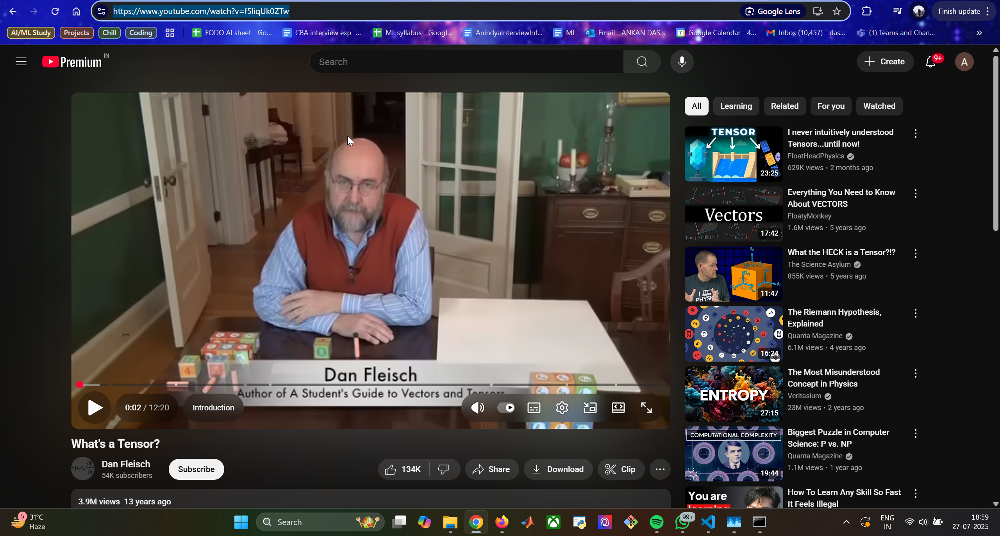
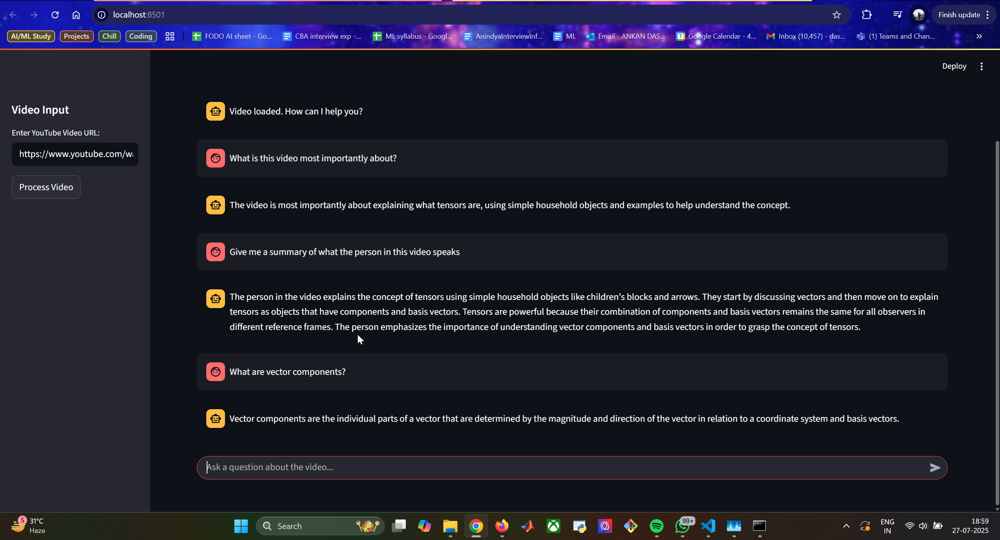

# 💬 YouTube Video Chat - A RAG Implementation

Welcome to an end-to-end **Retrieval-Augmented Generation (RAG)** system that allows you to have an intelligent conversation with any YouTube video — using nothing but its transcript!

You provide a YouTube URL, and the system extracts, processes, and chats with you in natural language, answering questions based **only on the content of the video**.

> 🧠 A fusion of NLP, GenAI, and modern software design — built from scratch with resilience, creativity, and curiosity.

---

## 🚀 Live Demo

### 🎥 YouTube Video Used for Testing



### 🖥️ Working Streamlit Application




---

## ✨ Features

- **🎙️ Interactive Chat**: Talk to any YouTube video with transcript support.
- **🔗 Dynamic Ingestion**: Just paste the video URL — the rest is magic.
- **🧠 RAG Architecture**: Combines retrieval and generation to minimize hallucinations.
- **💸 Efficient Embedding Strategy**: Uses local embeddings (MiniLM) to reduce cost; only final generation uses OpenAI APIs.
- **🌐 Clean UI**: Built using **Streamlit** for a fast and elegant user experience.

---

## 🛠️ Tech Stack & Architecture

### 🧰 Tools & Libraries

- **Frontend & Backend**: Python, Streamlit
- **GenAI Framework**: LangChain
- **LLM**: OpenAI `gpt-3.5-turbo`
- **Embeddings**: `all-MiniLM-L6-v2` (via Hugging Face)
- **Vector Store**: FAISS
- **Transcript Fetching**: `youtube-transcript-api`

---

### 🧩 System Architecture: Classic RAG

```text
   ┌────────────┐
   │  YouTube   │
   └─────┬──────┘
         │
         ▼
┌─────────────────────┐
│ Transcript Fetching │ ◄────── youtube-transcript-api
└────────┬────────────┘
         ▼
┌─────────────────────┐
│     Chunking        │
└────────┬────────────┘
         ▼
┌─────────────────────┐
│ Embedding + Storage │ ◄────── all-MiniLM + FAISS
└────────┬────────────┘
         ▼
┌─────────────────────┐
│     Retrieval       │
└────────┬────────────┘
         ▼
┌─────────────────────┐
│     Generation      │ ◄────── OpenAI LLM
└─────────────────────┘
````

---

## ⚙️ Setup and Installation

### ✅ Prerequisites

* Python 3.8+
* Git

### 📦 Clone the Repository

```bash
git clone <your-github-repository-url>
cd youtube-chat-rag
```

### 🧪 Create and Activate a Virtual Environment

```bash
# Windows
python -m venv venv
venv\Scripts\activate

# macOS/Linux
python3 -m venv venv
source venv/bin/activate
```

### 📥 Install Dependencies

```bash
pip install -r requirements.txt
```

### 🔐 Set Environment Variables

Create a `.env` file in the root directory and add your OpenAI key:

```env
OPENAI_API_KEY="your_sk-..."
```

### 🖥️ Run the App

```bash
streamlit run streamlit_app.py
```

> A browser tab will open with the application interface.

---

## 🧩 Challenges & Development Journey

### 🔄 Frontend Pivot: Chrome Extension ➜ Streamlit

The original vision: a **Chrome Extension** + Flask backend for on-YouTube chat. It worked — but debugging was a nightmare:

* ⚠️ **CORS Errors** (chrome-extension:// to localhost)
* 🐌 **Slow Testing Cycle**
* 🔧 **Backend-Focus Dilution**

**🎯 Pivot Decision**: Drop Chrome Extension, adopt **Streamlit**. This allowed rapid iteration and brought focus back to the core: the RAG pipeline.

---

### 📜 The Great Transcript API Challenge

Fetching YouTube transcripts reliably wasn't smooth:

* ❌ `ModuleNotFoundError`: Missing LangChain community modules.
* ❌ `AttributeError: get_transcript`: Misunderstanding between static vs. instance method usage.

**💡 Solution**: Debugged the library in Colab. Realized the method must be called via `YouTubeTranscriptApi().get_transcript()` — not statically. Lesson: **Always read the docs... and test in isolation.**

---

### 🧠 Iterative Debugging: Lessons Learned

* 🛑 `TypeError: FetchedTranscriptSnippet object is not subscriptable`
* ✅ Fixed with: `chunk.text` instead of `chunk['text']`

This journey reflects **real-world development** — full of unexpected bugs, design pivots, and deep learning through debugging. Every fix led to better understanding and a more robust product.

---

## 📌 Final Notes

This project isn't just about answering questions from videos.

It's about:

* Understanding **RAG systems deeply**
* Navigating modern GenAI toolchains
* Making strategic architectural decisions
* Embracing real-world bugs with a mindset of growth

---

## 🙌 Acknowledgments

* [LangChain](https://github.com/hwchase17/langchain)
* [HuggingFace Transformers](https://huggingface.co/)
* [FAISS](https://github.com/facebookresearch/faiss)
* [youtube-transcript-api](https://github.com/jdepoix/youtube-transcript-api)

---

## 🧠 Author

**Ankan Das** — M.Tech AI | Deep Learning Enthusiast | Builder of useful things.

